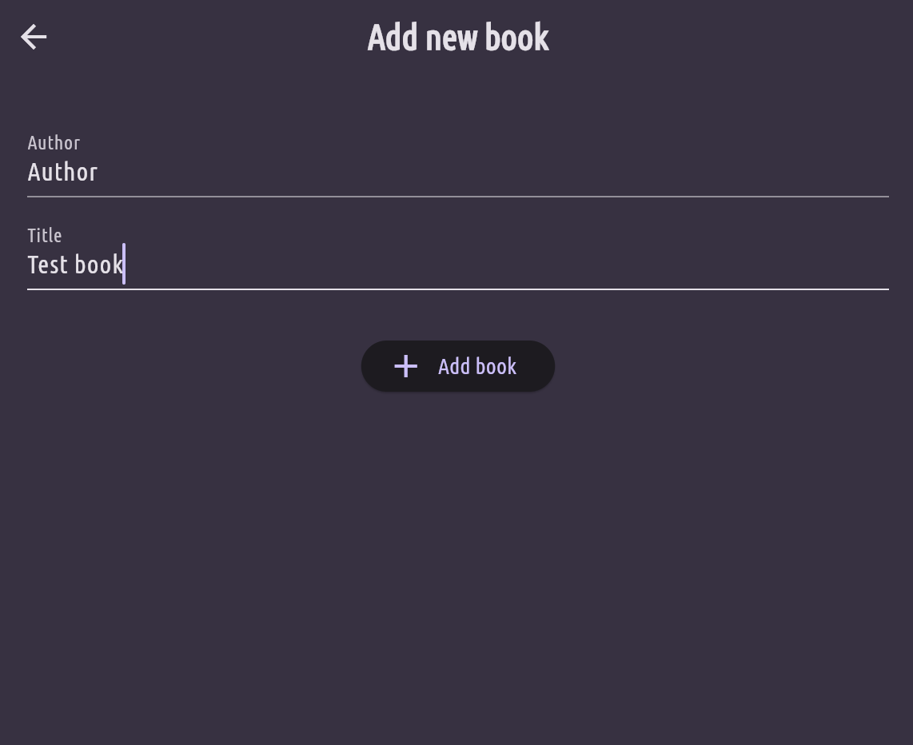

# favourite_books

## 📚 Favorite Books App 
App lets users build and manage a personalized list of their favorite books. Users can easily add new books by entering the title and author, view a list of all added books, and tap on any book to see detailed information.

State management is handled using **Riverpod’s `StateNotifierProvider`**, which ensures the UI stays reactive and updates instantly when books are added or changed.

## ➕ Add new books by providing title and author  

## 📋 View a dynamic list of all favorite books  

## 🔍 Tap on any book to see detailed information about it 
