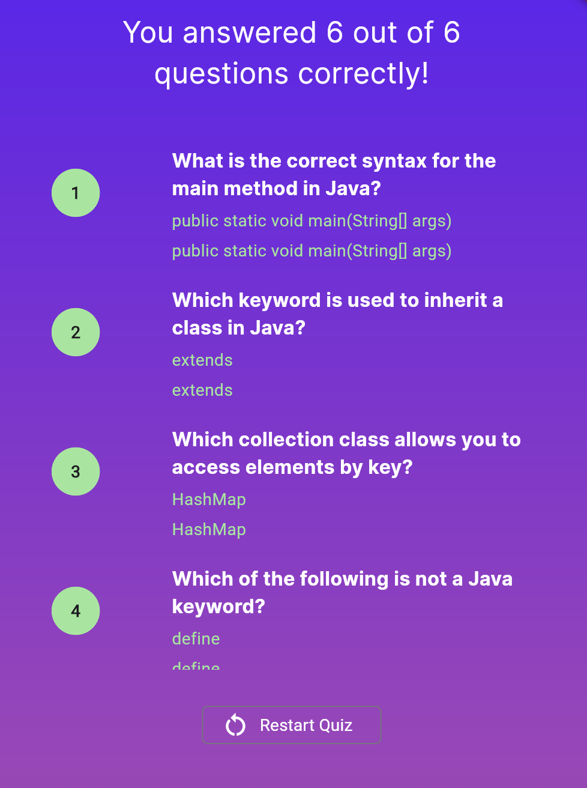

# java_quiz

# 📝 Java Quiz App

A Flutter app that quizzes users on Java programming fundamentals. The app features a start screen, multiple-choice questions with four answer options each, and a results summary at the end.

## 🖼️ Screenshots

