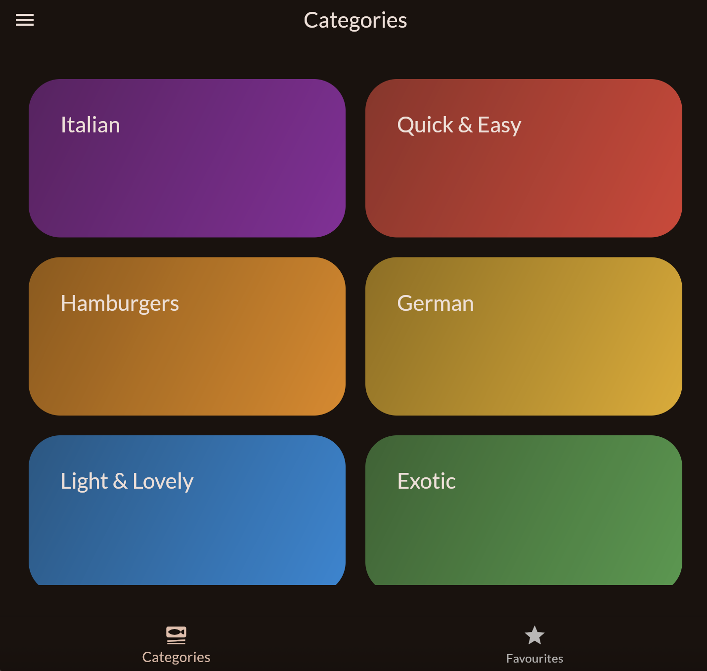
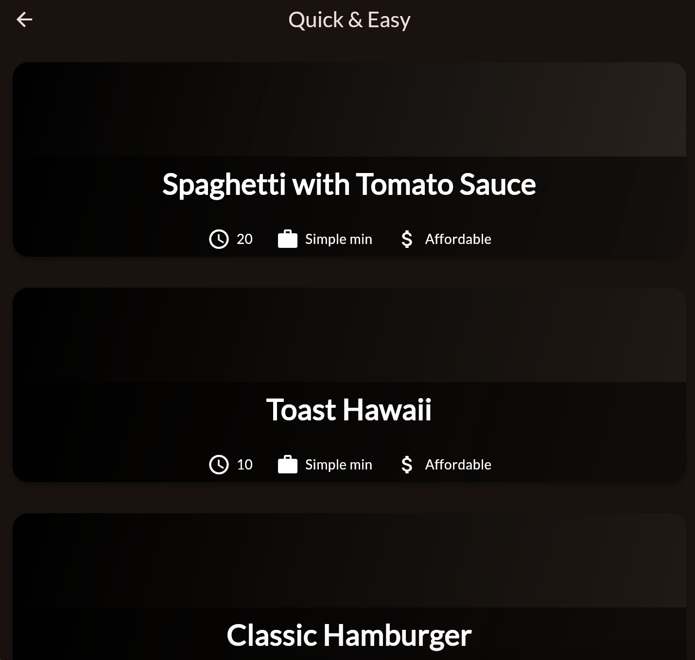
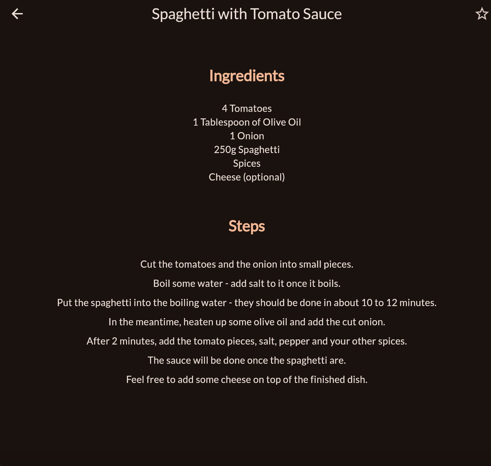
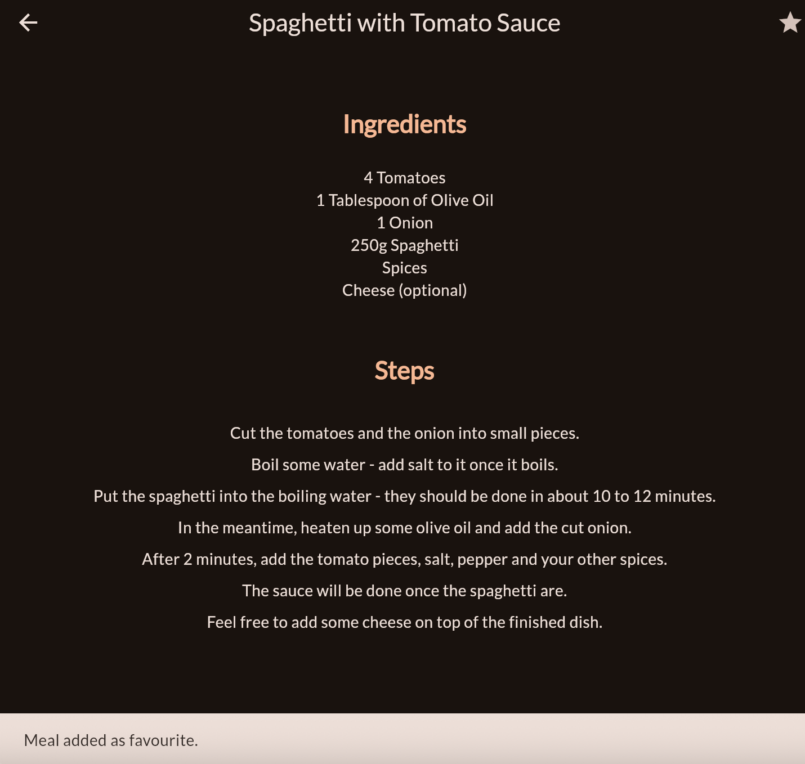
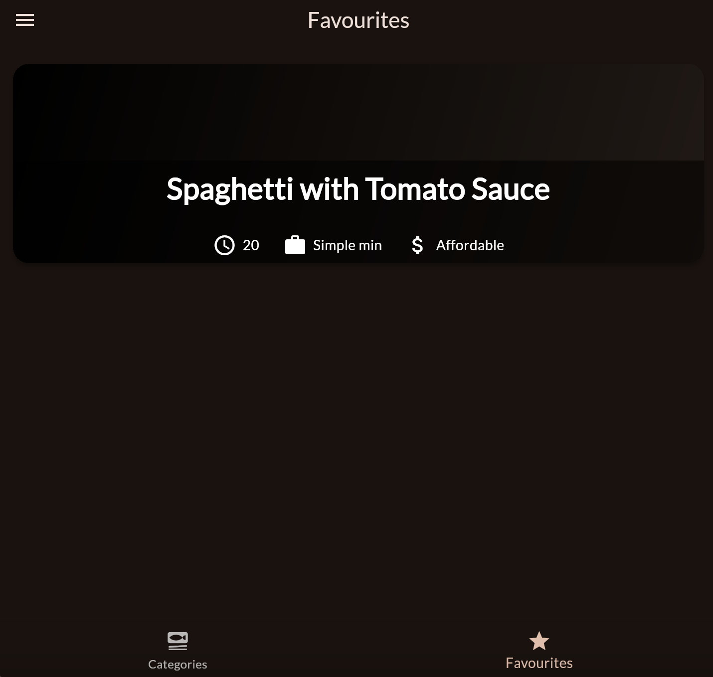
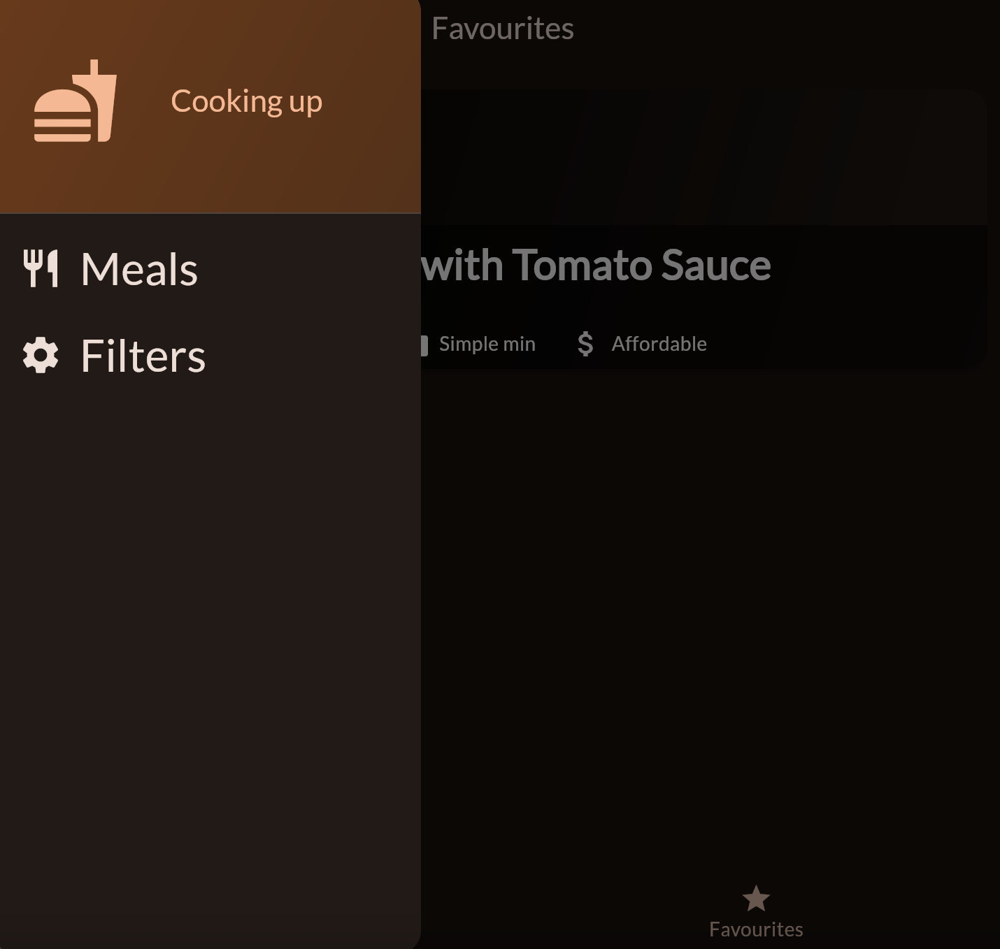
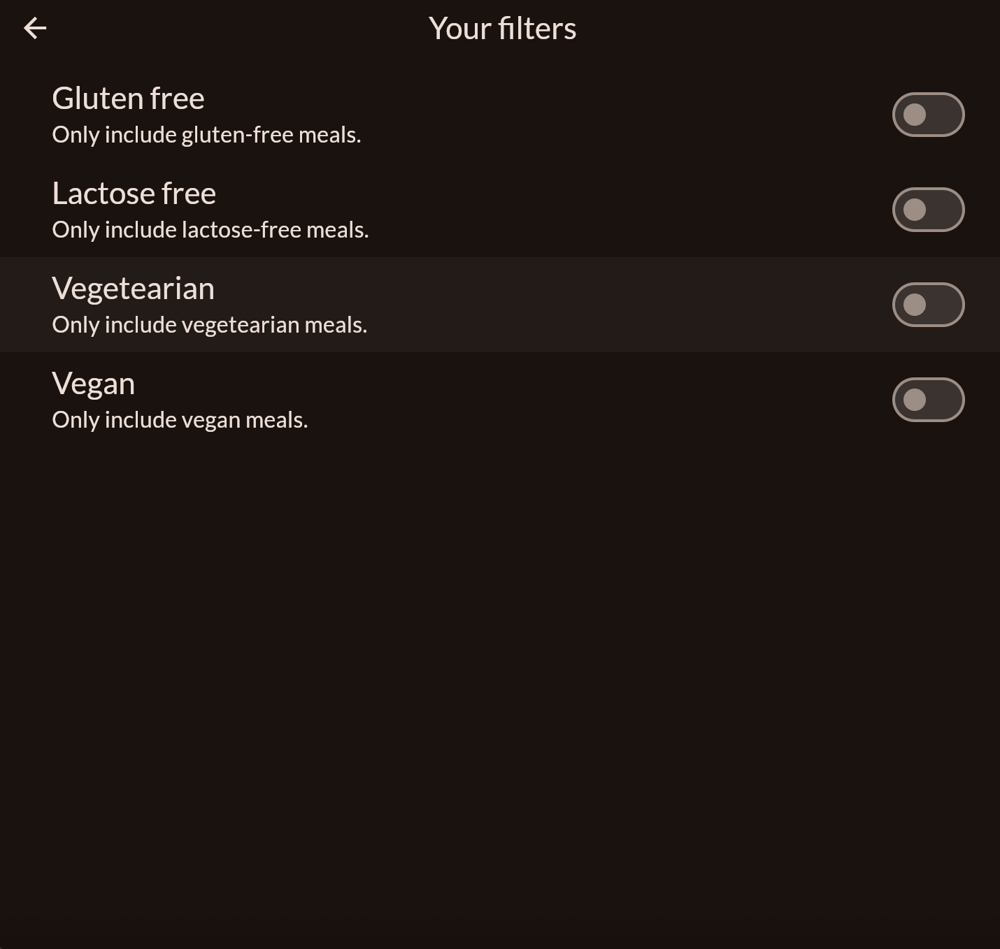

# meals

# 🍽️ Meals App

A Flutter app that helps users explore a collection of meals based on categories. Users can browse meals, view recipes, add meals to favorites, and filter content based on dietary needs.

## Categories Screen  
Displays a grid of meal categories (e.g., Italian, Asian, Quick & Easy).  
Tapping a category navigates to a list of meals under that category.

## Meals Screen  
Shows a list of meals for the selected category.  
Tapping a meal opens the detailed view.

## Meal Detail Screen  
Displays:
- 📋 Ingredients
- 🧑‍🍳 Step-by-step recipe instructions  
Users can also ⭐ add/remove the meal from favorites.

## Favorites Screen  
Displays all meals that the user has marked as favorites.

## Filters Screen 
Accessible via the navigation drawer 

Allows users to apply dietary filters such as:
- Gluten-free  
- Lactose-free  
- Vegan  
- Vegetarian  

The filters update the available meals shown throughout the app.
