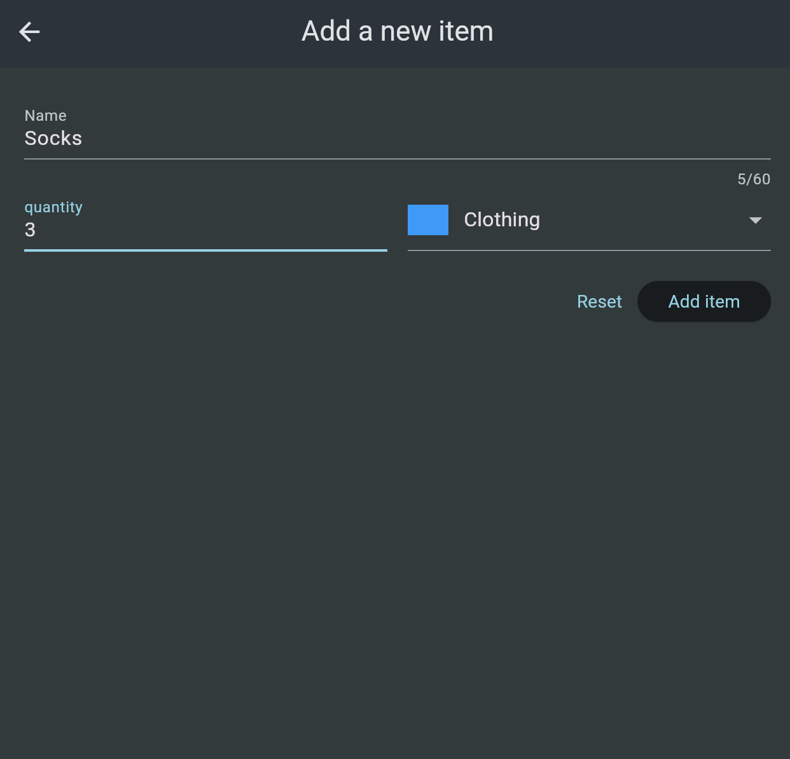
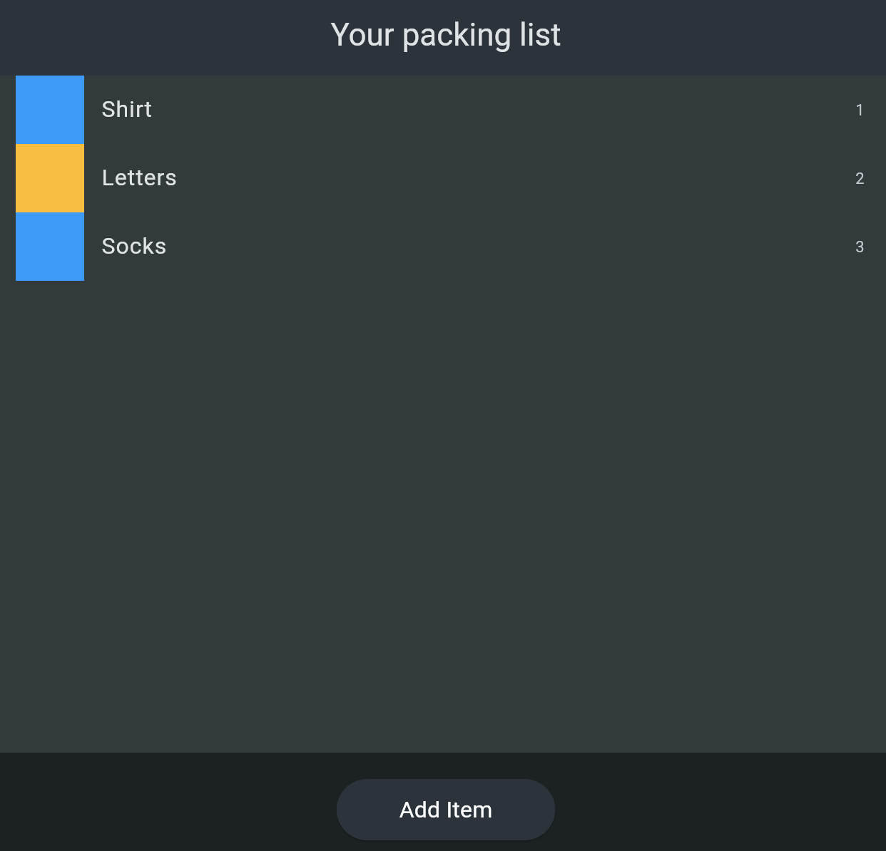
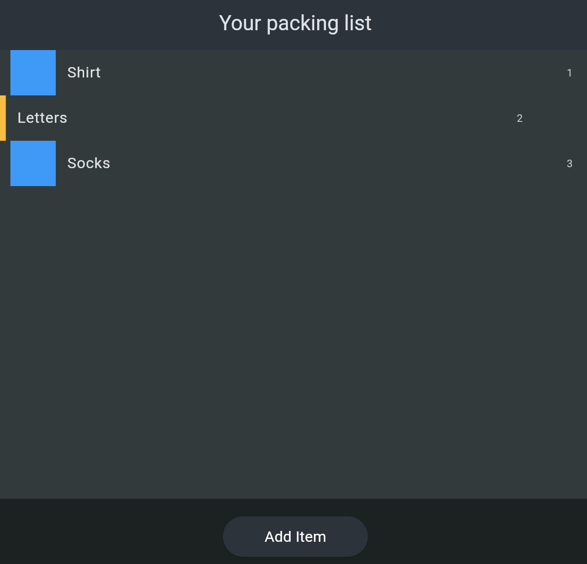

# packing_list

# 🎒 Packing List App

A Flutter app designed to help users create and manage packing lists for trips or daily needs. Users can add items with a name, quantity, and category, view the list of packed items, and remove items by swiping them away.

##  ➕ Add new packing items with:
  - Name
  - Quantity
  - Category (e.g., Clothing, Electronics, Toiletries)

##  📋 View a dynamic list of all packing items

##  🧹 Remove items using swipe gestures

