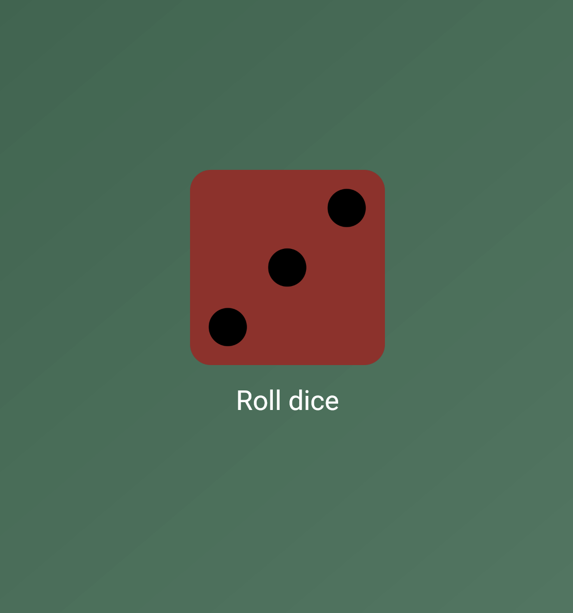
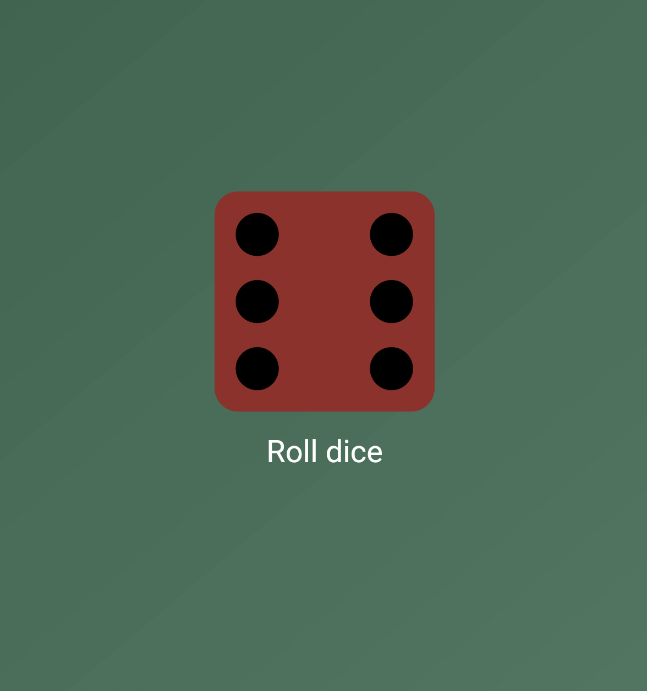

# roll_dice

🎲 Roll Dice App

A simple and fun Flutter app that simulates rolling dice. This was built as an early practice project while learning Flutter basics like stateless widgets, stateful widgets.

## 🖼️ Screenshot

