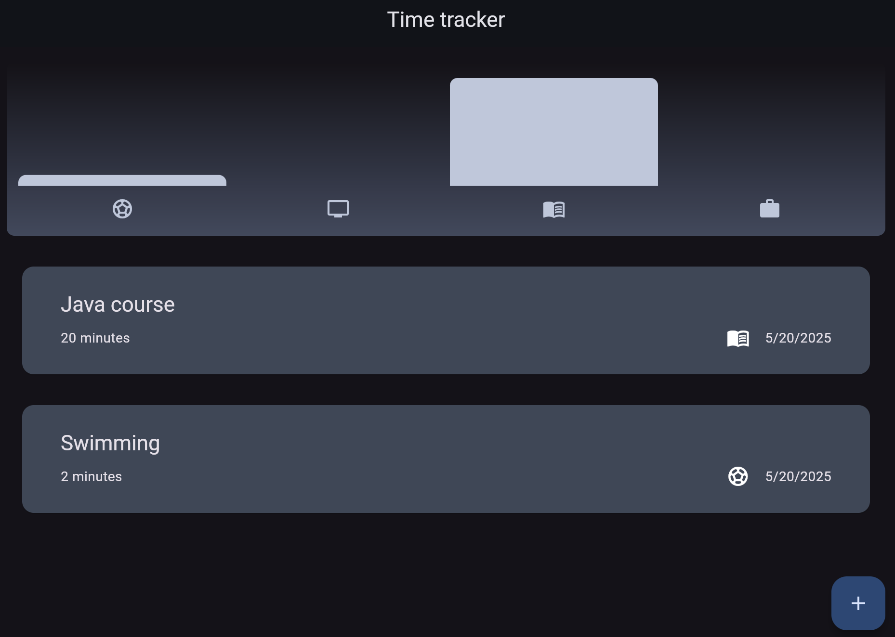
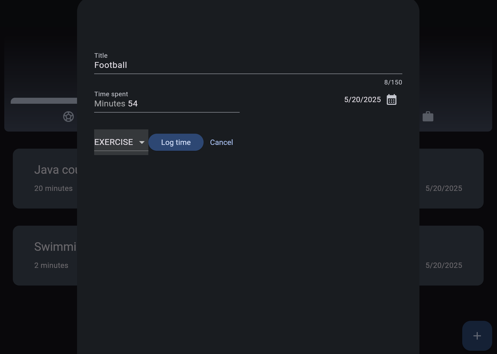
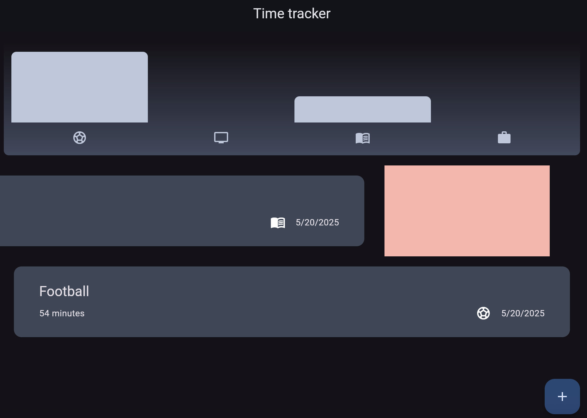
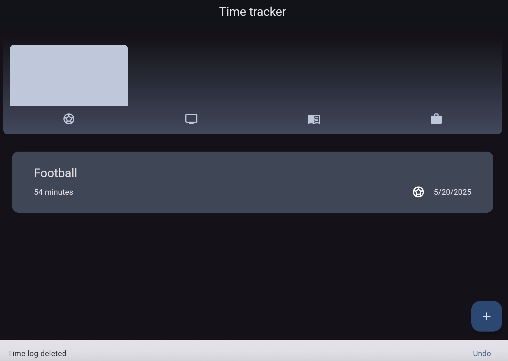

# time_logger

## 🧾 Time Tracker app
Time spent in each category is displayed in a dynamic bar chart. 

There are four categories:
- ⚽ exercise
- 📖 learning
- 🧳 leisure
- 💻 work

 As users add or remove time logs, the chart updates automatically to reflect, and all individual time logs are shown in a list.

## ➕ Add Logs
Users can add a new time log by clicking on + button:

## 🧹 Remove Logs
Logs can be removed using a swipe gesture

After a log is removed, a message is shown that allows the user to undo the deletion by clicking an undo button, restoring the removed entry.

